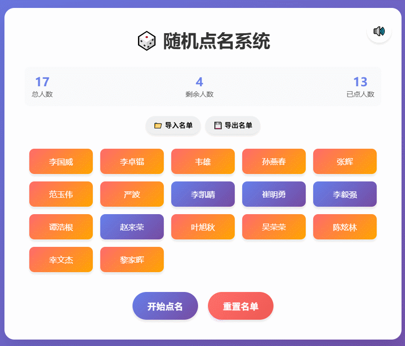

### 🎯 学生随机点名系统

一个功能完善、界面美观的现代化随机点名系统，专为教育场景设计，支持声音效果、数据持久化和文件导入导出。

## 📸 效果展示

### 🎨 现代界面效果
<div align="center">
  
  <p><em>现代化响应式界面，支持动态效果和声音反馈</em></p>
</div>

### 📊 功能亮点
- **实时统计**：显示总人数、剩余人数、已点人数
- **动态效果**：点名时的颜色渐变和动画
- **声音反馈**：可选的音效提示
- **文件操作**：支持JSON/CSV/TXT格式的导入导出

## 🚀 项目特色

### 📊 业务特点
- **智能循环机制**：学生被点到后不再重复，直到所有人轮完自动重置
- **数据持久化**：关闭浏览器后数据不丢失，支持本地存储
- **灵活配置**：支持自定义学生名单，实时生效
- **可视化统计**：实时显示总人数、剩余人数、已点人数
- **批量操作**：支持学生名单的批量导入导出（JSON/CSV/TXT）

### 🎨 用户体验
- **响应式设计**：完美适配PC、平板、手机各种屏幕
- **动态效果**：点名时的颜色变化和动画效果
- **声音反馈**：可选的音效提示，增强课堂互动
- **一键重置**：快速重置点名状态，开始新一轮
- **深色主题**：现代化渐变背景，保护视力

### 🔧 技术栈

#### 前端技术
- **HTML5**：语义化标签，现代Web标准
- **CSS3**：
  - Flexbox弹性布局
  - CSS Grid网格系统
  - CSS动画和过渡效果
  - 响应式设计（媒体查询）
  - 渐变背景和阴影效果
- **JavaScript ES6+**：
  - 箭头函数
  - 模板字符串
  - 解构赋值
  - 扩展运算符(...)
  - Async/await异步处理
  - 模块化代码结构

#### 现代Web API
- **Web Storage API**：localStorage数据持久化
- **Web Audio API**：程序化声音生成
- **File API**：文件读取和导入功能
- **Blob API**：文件导出和下载
- **Drag & Drop API**：文件拖拽上传（预留）

#### 架构特点
- **模块化设计**：CSS、JavaScript完全分离
- **事件驱动**：基于用户交互的响应式设计
- **状态管理**：集中式应用状态管理
- **错误处理**：完善的错误捕获和用户提示
- **性能优化**：防抖处理、内存管理

## 📁 项目结构

```
chooseName/
├── index.html          # 主页面
├── css/
│   └── styles.css      # 样式文件（响应式设计）
├── js/
│   └── script.js       # 主要业务逻辑
├── images/
│   └── GIF.gif         # 背景动图
├── LICENSE             # 开源协议
└── README.md          # 项目说明
```

## 🎯 核心功能详解

### 1. 随机点名算法
```javascript
// 使用Fisher-Yates洗牌算法确保公平性
const selectedIndex = Math.floor(Math.random() * remainingStudents.length);
```

### 2. 数据存储机制
- **学生名单**：localStorage.getItem('students')
- **剩余学生**：localStorage.getItem('remainingStudents')
- **已点学生**：localStorage.getItem('selectedStudents')
- **用户设置**：localStorage.getItem('soundEnabled')

### 3. 文件格式支持
- **JSON**：结构化数据，支持复杂信息
- **CSV**：表格数据，兼容Excel
- **TXT**：纯文本，每行一个学生

### 4. 声音系统设计
- **Web Audio API**：浏览器原生音频处理
- **动态频率**：根据动画进度调整音调
- **用户控制**：一键开关，状态记忆

## 🚀 快速开始

### 本地运行
1. 克隆项目到本地
2. 进入项目目录
3. 启动本地服务器：
   ```bash
   npx http-server --port 8080
   ```
4. 访问 http://localhost:8080

### 在线使用
直接下载ZIP包，解压后在浏览器中打开 `index.html` 即可使用。

## 🎮 使用指南

### 基础操作
1. **开始点名**：点击"开始点名"按钮
2. **重置名单**：点击"重置"按钮恢复所有学生
3. **开关声音**：点击🔊/🔇图标控制音效

### 高级功能
1. **导入学生**：点击"导入名单"选择JSON/CSV/TXT文件
2. **导出名单**：点击"导出名单"保存当前学生列表
3. **清除缓存**：浏览器控制台执行：
   ```javascript
   localStorage.clear();
   location.reload();
   ```

## 📱 兼容性

- **浏览器**：Chrome 60+, Firefox 55+, Safari 12+, Edge 79+
- **设备**：桌面端、平板、手机全平台支持
- **分辨率**：320px - 4K分辨率完美适配

## 🛠️ 技术亮点

### 1. ES6+语法应用
```javascript
// 扩展运算符实现数组复制
const newArray = [...oldArray];

// 解构赋值简化代码
const {nameContainer, startBtn} = elements;

// 箭头函数和模板字符串
const render = () => `${students.length}名学生`;
```

### 2. 响应式设计
```css
/* 移动端优先的响应式设计 */
@media (max-width: 768px) {
  .container {
    padding: 1rem;
    margin: 1rem;
  }
}
```

### 3. 性能优化
- **防抖处理**：避免频繁DOM操作
- **内存管理**：及时清理定时器和事件监听
- **缓存优化**：DOM元素引用缓存

## 🎯 教育价值

- **课堂互动**：提升学生参与度
- **公平性**：确保每个学生都有机会
- **效率**：节省教师点名时间
- **记录**：完整的点名历史记录

## 📄 开源协议

MIT License - 详见 [LICENSE](LICENSE) 文件

## 🤝 贡献指南

欢迎提交Issue和Pull Request，共同完善这个项目！

---

**技术支持**：如有问题，请通过GitHub Issues反馈
**更新时间**：2025年1月
