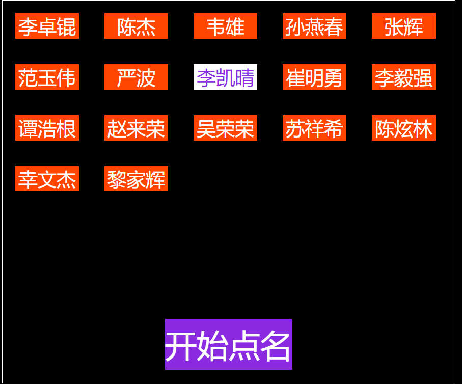

# 学生随机点名

    项目简介： 实现随机点名 并且上次抽到的学生不再重复 直到所有人都抽完 又进行下一个循环 
	（关闭浏览器无影响 备注：若已配置好学生集合，进行更改时需手动清除本地缓存，
	清除方法：在浏览器控制台输入window.localStorage.setItem("stu",null）而后按下ENTER键
	效果如下：


dfdsfsdafd
    js代码：
```angular2
window.onload = function () {
	var stu = ["李国威","李卓锟","韦雄","孙燕春","张辉","范玉伟","严波","李凯晴",
				"崔明勇","李毅强","谭浩根","赵来荣","叶旭秋","吴荣荣",
				"陈炫林","幸文杰","黎家晖"],
	                        //配置学生姓名 注：若更改学生集合，请手动清除本地存储。。
				//清除方法浏览器控制台输入window.localStorage.setItem("stu",null）而后按下ENTER键
			ls_sty = JSON.parse(window.localStorage.getItem("stu")),
			stuArray = ls_sty&&ls_sty.length?ls_sty:stu,
			box = document.querySelector(".box"),
			btn = document.querySelector(".start_choose_name"),
			/**
			 * 随机的下标 params array
			 */
			selected = (array) => {
				return Math.floor(Math.random() * array.length)
			},
			/*随机的颜色封装函数*/
			color = () => {
				let r = Math.floor(Math.random() * 256),
						g = Math.floor(Math.random() * 256),
						b = Math.floor(Math.random() * 256);
				return 'rgb(' + r + ',' + g + ',' + b + ')'
			};
	for (let i = 0; i < stu.length; i++){
		let div = document.createElement("div");
		div.setAttribute("class","stu_name");
		div.innerText = stu[i];
		box.appendChild(div);
	}
	/**
		* 禁止选择
		*/
	document.onselectstart = () => {
		return false
	};
	var allowClick = true,
			colorTimes = 0,
			timer,
			stuNameArray = document.querySelectorAll(".box>.stu_name");
	btn.onclick = () => {
		if (allowClick) {
			allowClick = false;
			btn.innerText = "点名中";
			timer = setInterval( () => {
				colorTimes ++;
				stuNameArray.forEach((item,index) => {
					item.style.cssText = "background:"+ color() + ";color:" + color();
				});
				if (colorTimes >= 20) {
					clearInterval(timer);
					allowClick = true;
					colorTimes = 0;
					btn.innerText = "开始点名";
					stuNameArray.forEach((item,index) => {
						item.style.cssText = "background:orangered;color:white;" ;
					});
					let _index = selected(stuArray);
					stuNameArray.forEach((item,index) => {
						if(item.innerText == stuArray[_index]) {
							item.style.cssText = "background:white;color:blueviolet;";
						}
					});
					console.info(stuArray);
					stuArray.splice(_index,1);
					window.localStorage.setItem("stu",JSON.stringify(stuArray));
					if(!stuArray.length){
						stuArray = stu
					}
				}
			},100)
		}
	};
};
```    
